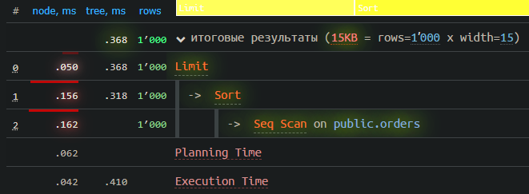
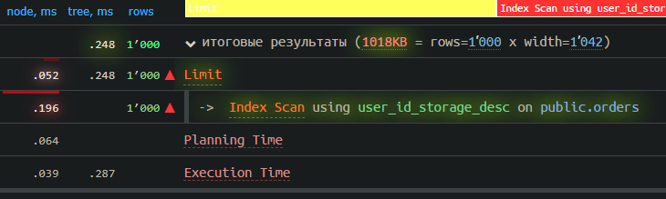
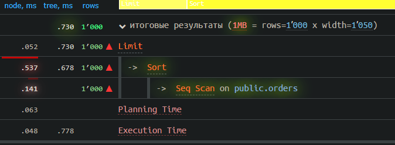
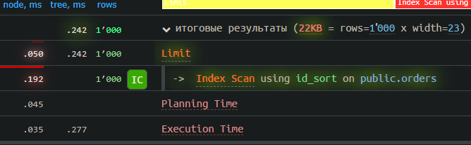

# Анализ использования индексов в данном проекте на основе 1000 запросов каждого вида
**Запуск анализа:**  
```sh
cd _sql_index
./explain_up.sh
# Выбрать вид запроса в _sql_index.go и запустить
make _sql_index
./explain_down.sh
```

## Индексы используемые для тестирования:
```sql
CREATE INDEX user_id_storage_desc ON orders (user_id, storage_until DESC);
CREATE INDEX id_sort ON orders (id ASC);
```

**Я решил, что буду использовать B-Tree (Потому что он поддерживает сортировку)индексы  
для ускорения сортировки и оптимизации выдачи списка заказов по пользователю**

## Insert
```
Insert on public.orders  (cost=0.00..0.01 rows=0 width=0) (actual time=0.030..0.031 rows=0 loops=1)
  ->  Result  (cost=0.00..0.01 rows=1 width=1566) (actual time=0.001..0.001 rows=1 loops=1)
        Output: '1000'::character varying(255), '1'::character varying(255), '2077-07-07 01:45:11.743128+03'::timestamp with time zone, false, '2028-08-08 12:32:19.743128+03'::timestamp with time zone, false, 'qwertyuiopasdfghjklyuasdfghjkzxcvbnm'::character varying(255)
Planning Time: 0.030 ms
Execution Time: 0.043 ms
```

Median Preparation Time: 0.03 ms
Median Execution Time: 0.05 ms

## Insert with index

```
Insert on public.orders  (cost=0.00..0.01 rows=0 width=0) (actual time=0.040..0.040 rows=0 loops=1)
  ->  Result  (cost=0.00..0.01 rows=1 width=1566) (actual time=0.001..0.001 rows=1 loops=1)
        Output: '1000'::character varying(255), '1'::character varying(255), '2077-07-07 01:45:11.743128+03'::timestamp with time zone, false, '2028-08-08 12:32:19.743128+03'::timestamp with time zone, false, 'qwertyuiopasdfghjklyuasdfghjkzxcvbnm'::character varying(255)
Planning Time: 0.032 ms
Execution Time: 0.052 ms
```

Median Preparation Time: 0.03 ms
Median Execution Time: 0.05 ms


--------------------------------------------------
## Update


```
Update on public.orders  (cost=0.28..8.29 rows=0 width=0) (actual time=0.044..0.044 rows=0 loops=1)
  ->  Index Scan using orders_pkey on public.orders  (cost=0.28..8.29 rows=1 width=16) (actual time=0.029..0.030 rows=1 loops=1)
        Output: true, '2028-08-08 12:32:19.743128+03'::timestamp with time zone, false, ctid
        Index Cond: ((orders.id)::text = '999'::text)
Planning Time: 0.061 ms
Execution Time: 0.061 ms
```

Median Preparation Time: 0.06 ms
Median Execution Time: 0.06 ms

## Update with index

```
Update on public.orders  (cost=0.28..8.29 rows=0 width=0) (actual time=0.045..0.045 rows=0 loops=1)
  ->  Index Scan using id_sort on public.orders  (cost=0.28..8.29 rows=1 width=16) (actual time=0.029..0.030 rows=1 loops=1)
        Output: true, '2028-08-08 12:32:19.743128+03'::timestamp with time zone, false, ctid
        Index Cond: ((orders.id)::text = '997'::text)
Planning Time: 0.064 ms
Execution Time: 0.061 ms
```

Median Preparation Time: 0.07 ms
Median Execution Time: 0.07 ms


-------------------------------------------------
## Select exists

```
Result  (cost=8.29..8.30 rows=1 width=1) (actual time=0.020..0.020 rows=1 loops=1)
  Output: $0
  InitPlan 1 (returns $0)
    ->  Index Only Scan using orders_pkey on public.orders  (cost=0.28..8.29 rows=1 width=0) (actual time=0.019..0.019 rows=1 loops=1)
          Index Cond: (orders.id = '999'::text)
          Heap Fetches: 1
Planning Time: 0.067 ms
Execution Time: 0.035 ms
```

Median Preparation Time: 0.06 ms  
Median Execution Time: 0.03 ms


## Select exists with index

```
Result  (cost=8.29..8.30 rows=1 width=1) (actual time=0.019..0.019 rows=1 loops=1)
  Output: $0
  InitPlan 1 (returns $0)
    ->  Index Only Scan using id_sort on public.orders  (cost=0.28..8.29 rows=1 width=0) (actual time=0.018..0.018 rows=1 loops=1)
          Index Cond: (orders.id = '1000'::text)
          Heap Fetches: 1
Planning Time: 0.074 ms
Execution Time: 0.033 ms
```

Median Preparation Time: 0.06 ms  
Median Execution Time: 0.03 ms  


----------------------------------------------------
## SelectOrders

```
Limit  (cost=75.33..77.83 rows=1000 width=15) (actual time=0.288..0.368 rows=1000 loops=1)
  Output: id, user_id, issued, storage_until, returned
  ->  Sort  (cost=75.33..77.83 rows=1000 width=15) (actual time=0.288..0.318 rows=1000 loops=1)
        Output: id, user_id, issued, storage_until, returned
        Sort Key: orders.storage_until DESC
        Sort Method: quicksort  Memory: 103kB
        ->  Seq Scan on public.orders  (cost=0.00..25.50 rows=1000 width=15) (actual time=0.008..0.162 rows=1000 loops=1)
              Output: id, user_id, issued, storage_until, returned
              Filter: ((NOT orders.issued) AND ((orders.user_id)::text = '1'::text))
Planning Time: 0.062 ms
Execution Time: 0.410 ms
```
  
  
  
Median Preparation Time: 0.06 ms  
Median Execution Time: 0.41 ms  
  

## SelectOrders with index

```
Limit  (cost=0.14..8.16 rows=1 width=1042) (actual time=0.018..0.248 rows=1000 loops=1)
  Output: id, user_id, issued, storage_until, returned
  ->  Index Scan using user_id_storage_desc on public.orders  (cost=0.14..8.16 rows=1 width=1042) (actual time=0.017..0.196 rows=1000 loops=1)
        Output: id, user_id, issued, storage_until, returned
        Index Cond: ((orders.user_id)::text = '1'::text)
        Filter: (NOT orders.issued)
Planning Time: 0.064 ms
Execution Time: 0.287 ms
```
  
Median Preparation Time: 0.06 ms  
Median Execution Time: 0.28 ms  
  
  
  

-----------------------------------------------------
## SelectReturns

```
Limit  (cost=14.45..14.53 rows=32 width=1050) (actual time=0.648..0.730 rows=1000 loops=1)
  Output: id, user_id, storage_until, issued, issued_at, returned
  ->  Sort  (cost=14.45..14.53 rows=32 width=1050) (actual time=0.646..0.678 rows=1000 loops=1)
        Output: id, user_id, storage_until, issued, issued_at, returned
        Sort Key: orders.id
        Sort Method: quicksort  Memory: 103kB
        ->  Seq Scan on public.orders  (cost=0.00..13.65 rows=32 width=1050) (actual time=0.014..0.141 rows=1000 loops=1)
              Output: id, user_id, storage_until, issued, issued_at, returned
              Filter: orders.returned
Planning Time: 0.063 ms
Execution Time: 0.778 ms
```

Median Preparation Time: 0.063 ms  
Median Execution Time: 0.762 ms  
  
  


## SelectReturns with index

```
Limit  (cost=0.28..67.07 rows=1000 width=23) (actual time=0.008..0.242 rows=1000 loops=1)
  Output: id, user_id, storage_until, issued, issued_at, returned
  ->  Index Scan using id_sort on public.orders  (cost=0.28..67.07 rows=1000 width=23) (actual time=0.007..0.192 rows=1000 loops=1)
        Output: id, user_id, storage_until, issued, issued_at, returned
        Filter: orders.returned
Planning Time: 0.045 ms
Execution Time: 0.277 ms
```

Median Preparation Time: 0.05 ms  
Median Execution Time: 0.29 ms  
  
  
  

-----------------------------------------------------
### Insert, Update, Select exists:
    - уже используют B-Tree индекс.
    Скорость выполнения с индексами не изменяется

### Select returns и Select Orders:
    - Индекс на булевое значение, не увеличит скорость.

    - CREATE INDEX user_id_storage_desc ON orders (user_id, storage_until DESC);
    Вместо Seq Scan будет использоваться Index Scan using user_id_storage_desc on public.orders,
    что даст прирост в скорости при выполнении операции where.
    Сортировка в индексе также увеличит скорость.
    
    - CREATE INDEX id_sort ON orders (id ASC);
    Вместо Seq Scan будет использоваться Index Scan using id_sort on public.orders,
    сортировка в индексе увеличит скорость.


## (Select orders with index) vs (Select orders without index)
## Increae or Decrese in preparation/execution time:
#### Preparation Time
(0.06 - 0.06) / 0.06 * 100 = +0%
#### Execution Time
(0.28 - 0.41) / 0.41 * 100 = -31% (decrease)

Использование индекса обеспечивает хорошее 30% повышение производительности.

## Select returns vs Select returns with index
## Increae or Decrese in preparation/execution time:
#### Preparation Time
(0.05 - 0.063) / 0.063 * 100 = -20% (decrease)
#### Execution Time
(0.29 - 0.762) / 0.762 * 100 = -62% (decrease)

Использование индекса обеспечивает отличное 62% повышение производительности.

## Вывод
При использовании индексов общее время затраченное подготовку и выполнение  
уменьшается на 20% и 93% соответственно.

Вывод: Следует использовать индексы, но использовать с умом,  
много индексов будут замедлять базу.